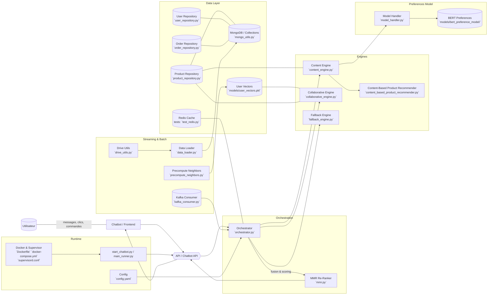

## Architecture – Système Hybride Intelligent (Recommendation System)

La vue ci-dessous modélise l'architecture logique du système de recommandation hybride qui combine filtrage collaboratif, contenu/présence sémantique (BERT), et un réordonnancement MMR, orchestré derrière des APIs et une interface chatbot.



### Notes
- Le système est hybride: il combine un moteur collaboratif (`collaborative_engine.py`) et un moteur basé contenu/semantique (`content_engine.py` + BERT via `model_handler.py`), avec un mécanisme de re-rang MMR (`mmr.py`).
- Les dépôts (`product_repository.py`, `user_repository.py`, `order_repository.py`) s'appuient sur MongoDB (`mongo_utils.py`). Redis sert de cache à faible latence.
- Le composant `precompute_neighbors.py` met à jour les représentations/vecteurs utilisateurs (`models/user_vectors.pkl`) pour accélérer le collaboratif.
- L'API et le Chatbot (voir `api.py`, `chatbot_api.py`, `chatbot_handler.py`) exposent les recommandations au frontend.
- `kafka_consumer.py` permet l'ingestion d'événements en temps réel pour adapter les recommandations.

### Export de l'image
- Vous pouvez ouvrir ce fichier dans un éditeur compatible Mermaid (VS Code avec l'extension Mermaid) puis exporter en PNG/SVG.
- Ou utiliser la CLI Mermaid (mmdc):

```bash
npx @mermaid-js/mermaid-cli -i "Documentation RecSys/architecture_hybride_intelligent.md" -o "Documentation RecSys/architecture_hybride_intelligent.svg"
```


